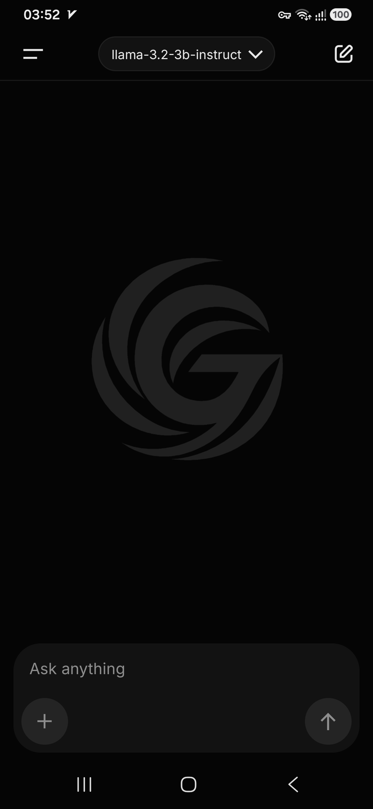
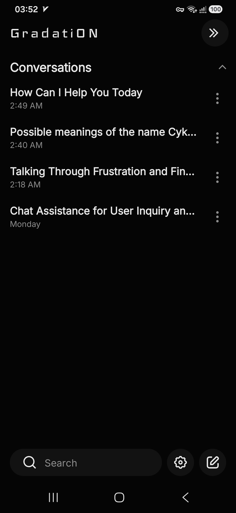
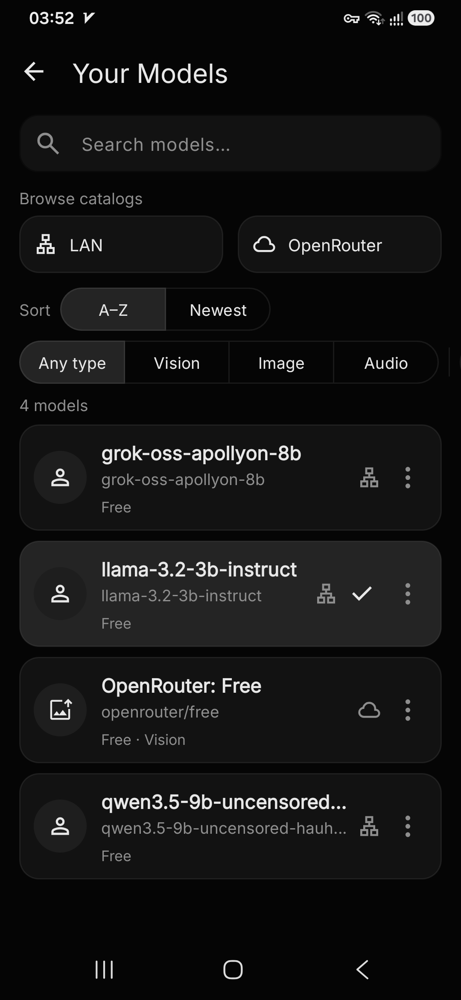
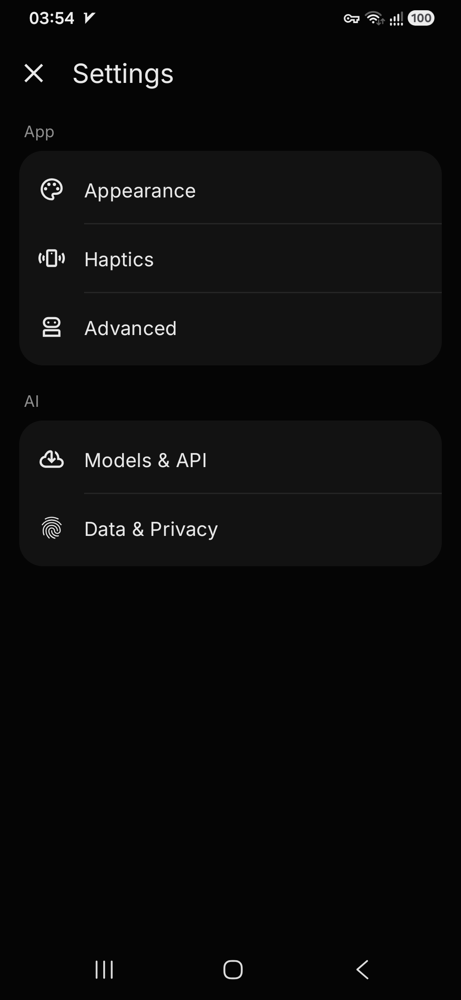

# GradatiON

Personal Android LLM chat client — dark monochrome UI, OpenRouter + LAN backends. Fork of [oxproxion](https://github.com/stardomains3/oxproxion).

| | |
|--|--|
| **Package** | `io.github.warexpor.grokion` (unchanged for installs) |
| **Repo** | [Warexpor/Grokion-personal-preference-fork](https://github.com/Warexpor/Grokion-personal-preference-fork) |
| **License** | Apache 2.0 |
| **SDK** | min 31 / target 36 |

Not affiliated with xAI, Grok, or OpenRouter.

## Screenshots

| Chat | History | Models | Settings |
|------|---------|--------|----------|
|  |  |  |  |

## Backends

| Backend | Transport | Notes |
|---------|-----------|--------|
| [OpenRouter](https://openrouter.ai/) | HTTPS | API key + credits |
| Ollama, LM Studio, llama.cpp, MLX LM, Hermes Agent | LAN HTTP(S) | You host the server |

HTTP LAN URLs are limited to private, loopback, link-local, or `.local` hosts. HTTPS can target any host. Self-signed LAN TLS: **Settings → AI → Models & API → Trust self-signed LAN TLS** (off by default).

## UI

GradatiON shell: sparse top bar, composer pill, history drawer, grouped settings cards. Inter for body text; Iceland wordmark in History. Design notes: [`DESIGN.md`](DESIGN.md), [`SHELL.md`](SHELL.md).

## Capabilities

- Streaming / non-streaming chat; vision and image generation where supported
- System messages, presets (share targets), reasoning controls, web search (OpenRouter)
- Autosave to History; pin, rename, import/export
- In-chat forks (edit / resend / delete with branch navigator)
- On-device PDF export; Markwon markdown
- Tool calling (workspace files, calendar, timers, Brave search, …) — off by default
- Workspace: `Download/gradation` (reads legacy `grokion` / `oxproxion`)
- TTS + file transcription models; **live STT / Voice settings disabled** in this build
- SQLCipher chat DB; Keystore-wrapped API keys; no trackers or ads

## Build

```bash
git clone https://github.com/Warexpor/Grokion-personal-preference-fork.git
cd Grokion-personal-preference-fork
./gradlew :app:assembleDebug
```

Android Studio: AGP 8.13+, JDK 17, run `app`. Version: `app/build.gradle.kts` → `versionName` and [`CHANGELOG.md`](CHANGELOG.md).

## Setup

1. **OpenRouter** — Settings → AI → Models & API → API key.
2. **LAN** — same screen; set base URL (+ key if required). For Hermes Agent, enable its API server on the host.

In-app **Help** (Settings → Advanced) covers UI, tools, and Hermes setup.

## Privacy (summary)

- Chats on device only; encrypted at rest
- Cloud backup excludes prefs and the chat database
- OpenRouter / provider policies apply to cloud traffic; LAN HTTP is cleartext unless you use HTTPS
- 18+ · as-is, no warranty

Upstream oxproxion: [releases](https://github.com/stardomains3/oxproxion/releases) · [F-Droid](https://f-droid.org/en/packages/io.github.stardomains3.oxproxion/)
